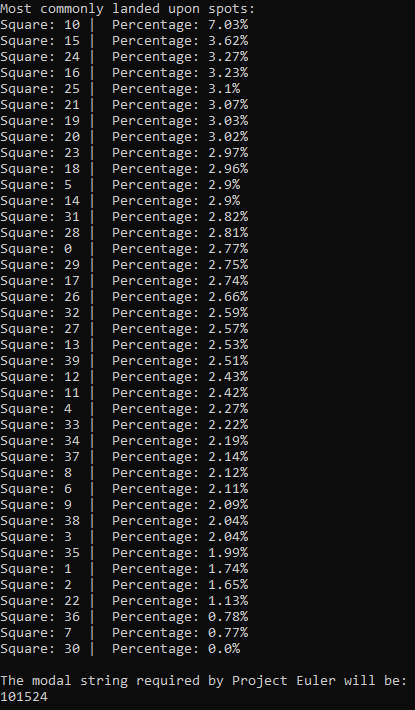

# Overview
In order to solve the top three most visited spots on the Monopoly board when four-sided dice are used instead, I chose to implement a system that simulates the game being played where locations visited are recorded. A simulation like this is required due to how complicated an analytical solution would be given how many possible game situations there could be. After one million dice rolls we reach a very accurate answer.

Although the board in the original problem is labeled with helpful labels like "G2J" for "Go to Jail", for my programmatic solution I chose to rather use raw integers from 0 to 39 to label the 40 squares on the board. I chose to do this so that I wouldn't have to use an unnecessary array with location names when the solution requires integer values anyway.

# Implementation

## Functions (Lines 5 to 125)
Several functions are laid out that provide appropriate information in order to complete the functionality of the game simulation.

`roll_dice(dice_range)` will return how far the player should travel and if they rolled doubles. It takes the form of a size two array with the sum of two random integers from 1 to the `dice_range` amount specified, along with a boolean value. This is needed in order to keep track of whether the player needs to go to jail, because after three "doubles" in a row, the player will be sent to jail. Excluding the boolean value is not an option because the sum number alone will not tell whether doubles was rolled. For example, if we move 8 spaces, we don't know if that was due to 4 + 4 or 3 + 5.

`chance(current_position)` will return the space that the player should travel to. A random variable "decision" is rolled that signifies what card the player drew from the Chance pile. Only 10 of the 16 cards imply a movement, so the other six cards can be discarded in the context of this problem. Some of the card movements are dependent upon the current square that the player is on, so the `current_position` is utilized to provide an appropriate output. Returns -1 if no movement should arise as a result of the drawing of the card.

`community_chest()` is a less intense version of the `chance()` function that doesn't require any current position and only 2 out of 16 cards imply a movement. Also returns -1 if no movement should occur.

`player_move(start_position)` will first roll the dice, and then unpack the data from the `roll_dice` function and separate out to keep track of how many doubles have been rolled in a row along with where the player will land. The `roll_dice` function is called with a parameter of 4 because the prompt calls for the most visited squares when four-sided dice are used instead of six-sided dice. If the player lands on a Chance or a Community Chest then it will use the appropriate function as outlined above in order to see where the player should be after the move. This function will return the new integer denoted square the player should land on.

## Core Program Flow (Lines 130 to 159)
First, we create a boards array that will keep track of how many times each spot has been visited.

We repeat 500,000 player rolls and record the ending position after each roll by incrementing the index of the boards array corresponding to that space on the board by one. Next, we divide how many times each spot has been visited by the total number of moves made (500,000). We multiply by 100 to make the percentage more readable.

Finally, we pack the board positions into a dictionary so that we can sort by the value but retain the index associated with the board square and then sort. We display those in a human friendly manner.

Project Euler requires an answer in the form of "XXYYZZ" where XX, YY, ZZ correspond to the integer representation of the top three most visited board locations when four-sided dice are used. This is printed out in the program's conclusion.

# Output
We discover that squares 10, 15, and 25 are the most visited squares, making 101524 our desired modal string.

